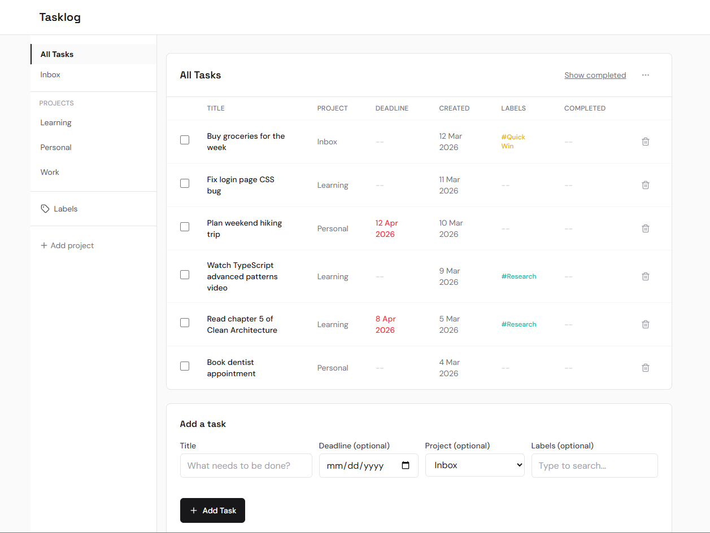
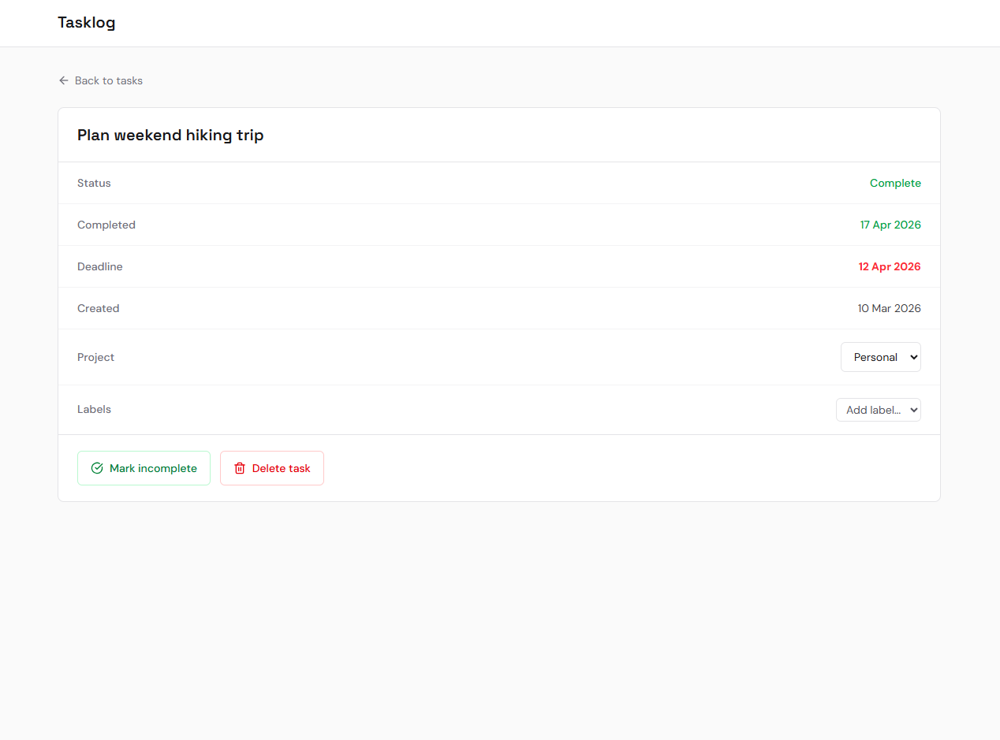
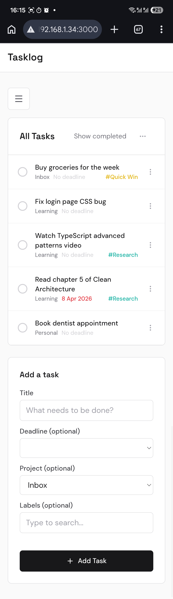
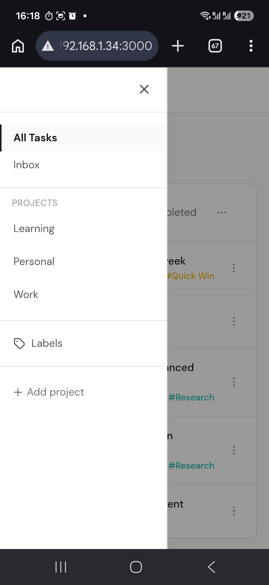

# Tasklog

**Own your tasks. No subscription. No cloud dependency.**

[](https://github.com/hydraInsurgent/Tasklog/actions/workflows/release.yml)
[](https://github.com/hydraInsurgent/Tasklog/releases/latest)
[](LICENSE)


---

**Tasklog is a self-hosted task manager. Tasks, projects, labels, and deadlines - runs on your machine, accessible from any browser on your network.**

No account. No subscription. The feature set is deliberately focused: everything a daily task workflow needs, nothing added to justify a recurring bill.

---

## Who it's for

- People who prefer local-first tools over cloud services
- Developers who want full ownership of their data and workflow
- Users tired of subscription-based productivity apps
- Individuals who value simplicity over feature bloat

---

## Why it exists

I was using the simplest parts of a powerful task manager and paying for the rest. When the subscription price jumped 3x, I realised I was paying for features I didn't use and the value no longer justified the cost - it forced a question I hadn't thought to ask before: not which tool to switch to, but whether I wanted to keep depending on one I didn't own.

I wanted a task system I understood completely - one where the data, the workflow, and what gets built next were all mine to decide. Tasklog is that. Runs on my machine, works across all my devices, and evolves when I need it to.

- **Complete ownership** - data stays local, in a file I control and can move anytime
- **No service dependency** - no pricing that can change, no sync service to go down, no account to manage
- **Built around real use** - every feature is something I actually use daily
- **Grows on my terms** - self-hosted and open source, it runs as long as I want and changes how I need

---

## Features

**Capture and organize**
- Add tasks with a title, deadline, project, and labels in one step
- Inbox as the default catch-all; create custom projects for everything else
- Labels with color coding for cross-cutting organization and filtering

**Track and complete**
- Deadline color coding - red when overdue, yellow when due within 3 days
- Checkbox completion with a clean animation - done tasks step aside, not deleted
- Show/hide completed tasks and undo completion at any time
- Task detail page with full status and completion history

**Works everywhere**
- Clean table on desktop, card view on mobile
- Background auto-refresh - changes from other devices appear without a reload
- All data stored locally - no cloud, no account, no sync service required
- Cross-platform and runs on Windows, macOS, and Linux - your laptop or a home server, whatever fits your setup

---

## Screenshots

**Desktop**



**Task detail**



**Mobile**





---

## Download

Ready-to-run packages - no prerequisites needed. Extract and run.

| Platform | Download |
|----------|----------|
| Windows (x64) | [Tasklog-win-x64.zip](https://github.com/hydraInsurgent/Tasklog/releases/latest/download/Tasklog-win-x64.zip) |
| macOS (Apple Silicon) | [Tasklog-mac-arm64.tar.gz](https://github.com/hydraInsurgent/Tasklog/releases/latest/download/Tasklog-mac-arm64.tar.gz) |
| macOS (Intel) | [Tasklog-mac-x64.tar.gz](https://github.com/hydraInsurgent/Tasklog/releases/latest/download/Tasklog-mac-x64.tar.gz) |
| Linux (x64) | [Tasklog-linux-x64.tar.gz](https://github.com/hydraInsurgent/Tasklog/releases/latest/download/Tasklog-linux-x64.tar.gz) |

> **macOS note:** The app is not code-signed. On first run, open System Settings > Privacy & Security and click "Open Anyway" if macOS blocks it.

---

## Quick Start

1. Extract the downloaded package
2. Run `Tasklog.exe` (Windows) or `./Tasklog` (macOS/Linux) and open the URL shown in the console

That's it. The app opens in your browser.

**Windows first-run notes:**
- If Windows SmartScreen warns the app is unrecognized, click "More info" then "Run anyway"
- When prompted by Windows Firewall, allow network access for both the backend API and Node.js - this is needed for the app to work on your local network

---

## Roadmap

### Near term (v2.x)

- Dark mode and custom themes
- Dedicated device setup guide (Raspberry Pi, Term home server)
- Task editing from the main list

### v3.0 - AI and integrations

The next major version brings intelligent input and external integrations - the features that made me question whether I needed a subscription in the first place, now built the way I actually want them.

**Natural language input**
Type tasks the way you think them. `Submit design review by Friday #work` gets parsed into a title, deadline, and label automatically. No separate date picker, no dropdown for project - just a single input that understands context.

**MCP integration**
Expose Tasklog as a tool via [Model Context Protocol](https://modelcontextprotocol.io). Claude Code, Obsidian, or any MCP-compatible client can add tasks, complete them, and query your inbox directly - without opening a browser. The goal: your task system becomes a layer other tools can write to.

**Voice input**
Speak a task, let the NLP layer handle the rest. No extra service required - uses the browser's built-in speech API as the input layer.

### Later

- PostgreSQL migration when SQLite is no longer sufficient
- Offline access and sync - PWA with local task cache and background sync

---

## How it's built

```
Browser
  |
  v
Next.js frontend  --  UI, routing, client state
  |
  v
.NET Web API      --  data logic, REST endpoints
  |
  v
SQLite            --  local file, no database server needed
```

- Two independent processes that communicate over HTTP - frontend on port 3000, backend on port 5115
- No cloud, no external database - the SQLite file lives next to the backend executable
- Frontend serves the UI; backend owns all data operations

For full detail see [docs/architecture.md](docs/architecture.md).

---

## Tech Stack

- **Backend:** ASP.NET Core 10 Web API, Entity Framework Core, SQLite
- **Frontend:** Next.js 16 (App Router), React 19, Tailwind CSS v4
- **Icons:** Lucide React
- **Fonts:** Space Grotesk (headings), DM Sans (body)
- **Built with:** [Claude Code](https://claude.ai/code)

---

## Run from Source

For contributors or anyone who wants to run from the repository directly.

**Backend**

```bash
cd backend/Tasklog.Api
dotnet run
```

Runs on `http://localhost:5115` by default (see `Properties/launchSettings.json`).

**Frontend**

```bash
cd frontend
npm install
npm run dev
```

Runs on `http://localhost:3000`. Configure the API base URL in `frontend/.env.local`.

> Both servers must be running at the same time.

---

## Documentation

| File | What it covers |
|------|----------------|
| [docs/architecture.md](docs/architecture.md) | System structure, data model, API endpoints, component responsibilities |
| [docs/product-design.md](docs/product-design.md) | What the product is, who it's for, feature rules and current scope |
| [docs/engineering-guidelines.md](docs/engineering-guidelines.md) | Coding patterns, component conventions, known deviations |
| [CHANGELOG.md](CHANGELOG.md) | Version history and what changed in each release |

---

## Trade-offs

Tasklog is intentionally opinionated. Some things are not included by design:

- No cloud sync — all data stays local 
- Runs as a local server - on your laptop, desktop, or a dedicated home server
- Not built for team collaboration (yet)
- Limited integrations compared to SaaS tools

If these are dealbreakers, this might not be the right tool, and that's okay.

---

## License

[MIT](LICENSE)
